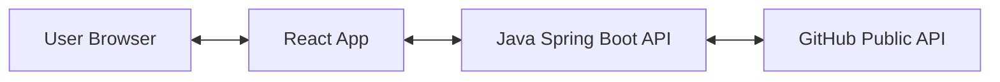

DevPortfolio - Fullstack (React + Java)
======================================

Portfolio pessoal para vagas de estagio/junior. O frontend é uma aplicação React e o backend é uma API Spring Boot que busca repos do GitHub e fornece os dados do perfil.

Este projeto também é um ambiente de aprendizado: mostra separação entre frontend e backend, como usar uma API publica via proxy e como centralizar configuracoes.

Funcionalidades
---------------
- Layout minimalista com foco em leitura.
- Lista de projetos do GitHub via API Java (o frontend não chama o GitHub direto).
- Dados do perfil carregados do backend.
- Layout responsivo.

Tech Stack
----------
Frontend
- React (Vite)
- Tailwind CSS
- Axios
- Lucide React

Backend
- Java 17
- Spring Boot (WebFlux)
- WebClient

Arquitetura
-----------
O navegador acessa o React, o React chama a API Java, e a API Java chama o GitHub.



Estrutura do Projeto
--------------------
```
.
├─ backend/        # API Spring Boot
├─ frontend/       # App React
└─ README.md
```

Pre-requisitos
--------------
- Node.js 18+
- Java JDK 17
- Maven 3.9+

Como Rodar Localmente
---------------------
1) Backend

O backend usa a API do GitHub. Para evitar limite de requisicoes (Erro 403), use um token:
1. Crie um token (Settings -> Developer Settings -> Personal Access Tokens -> Classic). Nao precisa de permissoes.
2. Rode com o comando:

Linux/Mac:
```bash
export GITHUB_TOKEN="seu_token_aqui"
mvn spring-boot:run
```

Windows (PowerShell):
```powershell
$env:GITHUB_TOKEN="seu_token_aqui"
mvn spring-boot:run
```
Caso nao use token, o limite sera de 60 req/hora.

API em http://localhost:8081

2) Frontend
```
cd frontend
npm install
npm run dev
```
App em http://localhost:5173

Configuracoes
-------------
Backend em backend/src/main/resources/application.yml

Principais valores:
- server.port: padrao 8081
- app.profile: nome, titulo, bio, links, stack, languages
- app.github.username: seu username do GitHub
- app.github.token: (opcional) token lido da variavel de ambiente
- app.github.perPage: numero de repos exibidos
- app.github.excludeForks: ocultar forks

Frontend:
- VITE_API_BASE (padrao http://localhost:8081)

Endpoints da API
----------------
- GET /api/profile   -> dados do perfil
- GET /api/repos     -> repositorios em destaque

Ideias de Personalizacao
------------------------
- Visual dos Projetos: No GitHub, va em Settings -> General -> Social preview para colocar uma imagem de capa e nao usar o fallback de icone.
- Ajustar cores e tipografia em frontend/src/index.css
- Atualizar conteudo em backend/src/main/resources/application.yml
- Adicionar foto/avatar
- Fixar projetos especificos em vez de ordenar por stars

Troubleshooting
---------------
- Porta em uso: altere server.port no application.yml ou libere a porta.
- Repos nao aparecem: confira app.github.username e teste http://localhost:8081/api/repos
- Frontend sem dados: confirme backend rodando e VITE_API_BASE correto.

Proximos Passos
---------------
- Escrever um About curto e direto.
- Adicionar screenshots ou GIFs.
- Publicar (Vercel para frontend, Render/Railway para backend).

Licenca
-------
MIT
