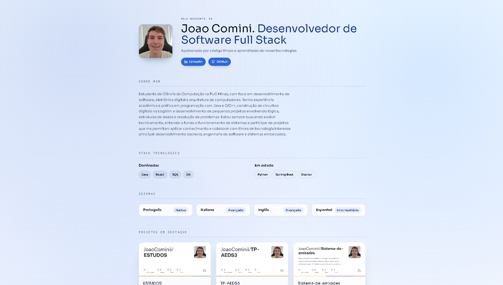
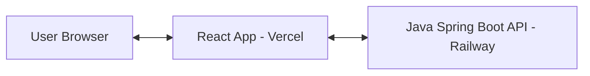

# DevPortfolio - Fullstack (React + Java)

Portfolio pessoal com dados estáticos configurados via código. Frontend em React (Vite) e backend em Spring Boot.



## Funcionalidades

- Layout minimalista com foco em leitura.
- Dados do perfil e projetos configurados estaticamente no backend.
- Suporte a múltiplas midias (imagens e videos) nos projetos.
- Pagina de detalhes para cada projeto.
- Badge "Privado" para repositorios que nao devem ser exibidos.
- Layout responsivo.

## Tech Stack

### Frontend
- React (Vite)
- Tailwind CSS
- Axios
- Lucide React
- React Router DOM

### Backend
- Java 17
- Spring Boot
- YAML (configuracao)

## Arquitetura



## Estrutura do Projeto

```
.
├─ backend/        # API Spring Boot
├─ frontend/       # App React (Vite)
└─ README.md
```

## Deploy

- **Frontend:** Vercel (https://joaocomini.dev)
- **Backend:** Railway (https://portifolio-profissional-production.up.railway.app)

## Pre-requisitos

- Node.js 18+
- Java JDK 17
- Maven 3.9+

## Como Rodar Localmente

### 1) Backend

```bash
cd backend
mvn spring-boot:run
```

API em http://localhost:8081

### 2) Frontend

```bash
cd frontend
npm install
npm run dev
```

App em http://localhost:5173

## Configuracoes

### Backend (backend/src/main/resources/application.yml)

```yaml
app:
  profile:
    name: "Seu Nome"
    title: "Seu Titulo"
    blurb: "Sua descricao"
    photoUrl: "URL da foto"
    about: "Sobre voce"
    location: "Sua localizacao"
    github: "seu_usuario_github"
    links:
      - label: "GitHub"
        url: "https://github.com/seu_usuario"
      - label: "LinkedIn"
        url: "https://linkedin.com/in/seu_usuario"
    stack:
      mastered:
        - Java
        - Python
        - SQL
      learning:
        - React
        - Spring Boot
        - Docker
    languages:
      - name: "Portugues"
        level: "Nativo"
      - name: "Ingles"
        level: "Avancado"
    featuredProjects:
      - id: 1
        name: "Nome do Projeto"
        tagline: "Descricao curta"
        description: "Descricao completa"
        media:
          - type: "image"
            url: "https://url-da-imagem.jpg"
        projectUrl: "https://github.com/seu_usuario/projeto"
        sourceUrl: "https://github.com/seu_usuario/projeto"
        tags: "React,Java,PostgreSQL"
        order: 1
```

### Frontend

- VITE_API_BASE (padrao http://localhost:8081)

## Campos de Projeto

| Campo | Descricao |
|-------|-----------|
| `id` | Identificador unico |
| `name` | Nome do projeto |
| `tagline` | Frase curta (exibida no card) |
| `description` | Descricao completa (exibida na pagina de detalhes) |
| `media` | Array de midias (imagens e videos) |
| `media[].type` | "image" ou "video" |
| `media[].url` | URL da midia |
| `projectUrl` | Link do projeto. Use "Privado" para repositorios privados |
| `sourceUrl` | Link do codigo fonte |
| `tags` | Tecnologias separadas por virgula |
| `order` | Ordem de exibicao |

## Endpoints da API

| Endpoint | Descricao |
|----------|-----------|
| GET /api/profile | Dados do perfil completo |
| GET /api/projects | Lista de projetos em destaque |
| GET /api/project/{id} | Detalhes de um projeto especifico |

## Paginas

- `/` - Pagina inicial com perfil e projetos
- `/project/{id}` - Pagina de detalhes do projeto

## Personalizacao

- **Visual:** Ajustar cores e tipografia em `frontend/src/index.css`
- **Conteudo:** Atualizar `backend/src/main/resources/application.yml`
- **Midias:** Adicionar imagens e videos nos projetos via campo `media`
- **Projetos Privados:** Usar `projectUrl: "Privado"` para exibir badge

## CORS

O backend permite requisicoes de:
- http://localhost:5173
- https://joaocomini.dev
- https://*.vercel.app

Para adicionar novos domínios, edite `@CrossOrigin` em `ProfileController.java`.

## Troubleshooting

- **Frontend sem dados:** Verifique se o backend esta rodando e VITE_API_BASE esta correto.
- **Erro CORS:** Verifique se o dominio esta na lista de origens permitidas no backend.
- **Build falhando:** Verifique se as dependencias estao instaladas (npm install / mvn clean install).

## Licenca

MIT
